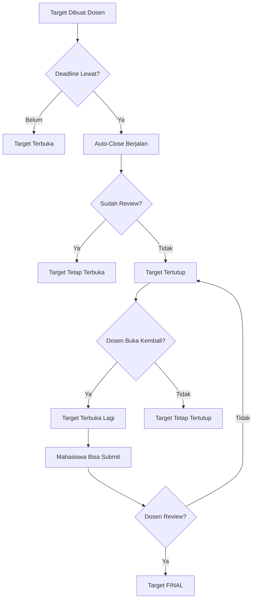

# Scenario Auto-Close Target Mingguan

## 🎬 Scenario Lengkap Penggunaan Fitur

### Scenario 1: Mahasiswa Belum Submit, Deadline Lewat

**Situasi:**
- Target: "Membuat Use Case"
- Deadline: 07/10/2025 23:59
- Sekarang: 08/10/2025 08:00
- Status: Belum submit (pending)

**Proses:**
1. Auto-close berjalan jam 00:01
2. Target otomatis **tertutup**
3. Status tetap `pending`
4. `is_open` berubah jadi `false`

**Hasil untuk Mahasiswa:**
- ❌ Tidak bisa submit lagi
- 🔴 Muncul badge "Target Tertutup"
- 📝 Pesan: "Target ditutup karena melewati deadline"
- ℹ️ Saran: "Hubungi dosen jika diperlukan"

**Hasil untuk Dosen:**
- 🔓 Tombol "Buka" tersedia (warna ungu)
- 📊 Bisa lihat target belum disubmit
- ✅ Bisa membuka kembali jika diperlukan

---

### Scenario 2: Mahasiswa Sudah Submit, Deadline Lewat

**Situasi:**
- Target: "Membuat ERD"  
- Deadline: 07/10/2025 23:59
- Submit pada: 07/10/2025 20:00 (TEPAT WAKTU)
- Sekarang: 08/10/2025 08:00
- Status: Sudah submit (submitted)

**Proses:**
1. Auto-close berjalan jam 00:01
2. Target otomatis **tertutup** ⚠️ (LOGIKA BARU!)
3. Status tetap `submitted`
4. `is_open` berubah jadi `false`

**Hasil untuk Mahasiswa:**
- ✅ Submission tersimpan (tidak hilang)
- ❌ Tidak bisa **edit** submission lagi
- 🔴 Badge "Target Tertutup" muncul
- 📝 Pesan: "Target sudah tertutup. Tidak dapat mengedit lagi."

**Hasil untuk Dosen:**
- 📊 Bisa lihat submission mahasiswa
- ✅ Bisa review submission
- 🔓 Bisa membuka kembali jika mahasiswa perlu revisi

---

### Scenario 3: Mahasiswa Submit Terlambat (Late Submission)

**Situasi:**
- Target: "Membuat Class Diagram"
- Deadline: 07/10/2025 23:59
- Mahasiswa submit: 08/10/2025 10:00 (TERLAMBAT)
- Tapi... target sudah tertutup oleh auto-close!

**Proses:**
1. Auto-close sudah menutup target jam 00:01
2. Mahasiswa coba submit jam 10:00
3. Sistem validasi: `canAcceptSubmission()` → return `false`
4. Redirect dengan error

**Hasil:**
- ❌ Submission ditolak
- 🔴 Error: "Target sudah tertutup. Tidak dapat mensubmit lagi."
- ℹ️ Mahasiswa harus hubungi dosen

**Solusi (Jika Dosen Mengizinkan):**
1. Dosen buka target kembali via tombol "Buka"
2. Mahasiswa bisa submit (dengan status `late`)
3. Dosen tutup kembali target setelah mahasiswa submit
4. Dosen review dengan catatan "terlambat"

---

### Scenario 4: Mahasiswa Submit, Ingin Edit, Tapi Deadline Sudah Lewat

**Situasi:**
- Target: "Membuat Sequence Diagram"
- Mahasiswa submit: 07/10/2025 22:00
- Mahasiswa ingin edit: 08/10/2025 09:00 (setelah deadline)
- Target sudah tertutup oleh auto-close

**Proses:**
1. Mahasiswa klik tombol "Edit Submission"
2. Sistem validasi: `canAcceptSubmission()` → return `false`
3. Redirect dengan error

**Hasil:**
- ❌ Tidak bisa edit
- 🔴 Pesan: "Target sudah tertutup karena melewati deadline"
- ✅ Submission tetap tersimpan (tidak hilang)

**Solusi:**
- Mahasiswa hubungi dosen dengan alasan valid
- Dosen evaluasi: apakah perlu dibuka kembali?
- Jika ya, dosen klik "Buka"
- Mahasiswa bisa edit
- Dosen tutup kembali setelah selesai

---

### Scenario 5: Dosen Review Target yang Tertutup

**Situasi:**
- Target sudah tertutup
- Mahasiswa sudah submit
- Dosen ingin review

**Proses:**
1. Dosen buka halaman target
2. Tombol "Review Submission" tetap tersedia
3. Dosen bisa review normal
4. Setelah review, target TIDAK bisa dibuka kembali

**Hasil:**
- ✅ Dosen bisa review meskipun target tertutup
- ✅ Setelah direview, target **FINAL** (tidak bisa dibuka lagi)
- 🔒 Tombol "Buka" hilang setelah direview

---

### Scenario 6: Dosen Membuka Kembali Target

**Situasi:**
- Target tertutup karena deadline lewat
- Mahasiswa punya alasan valid (sakit, masalah teknis, dll.)
- Dosen ingin membuka kembali

**Proses:**
1. Dosen login
2. Buka halaman "Kelola Target Mingguan"
3. Klik target yang tertutup
4. Klik tombol **"Buka Kembali Target"** (ungu)
5. Konfirmasi

**Hasil:**
- ✅ Target terbuka kembali
- ✅ `is_open` = true
- ✅ `reopened_by` = ID dosen
- ✅ `reopened_at` = timestamp sekarang
- 📝 Info: "Pernah dibuka kembali oleh [nama dosen] pada [tanggal]"

**Untuk Mahasiswa:**
- ✅ Bisa submit/edit lagi
- 🟢 Badge "Target Terbuka"
- 📝 Tombol submit muncul kembali

---

### Scenario 7: Dosen Menutup Target Manual (Sebelum Deadline)

**Situasi:**
- Ada situasi khusus (ujian, libur, dll.)
- Dosen ingin menutup target lebih awal
- Deadline: 10/10/2025 tapi dosen tutup 08/10/2025

**Proses:**
1. Dosen buka halaman target
2. Klik tombol **"Tutup Target"** (merah)
3. Konfirmasi

**Hasil:**
- 🔒 Target tertutup manual
- ❌ Mahasiswa tidak bisa submit
- 📝 Dosen bisa buka kembali kapan saja

---

### Scenario 8: Target Sudah Direview, Mahasiswa Minta Revisi

**Situasi:**
- Target sudah direview dosen
- Status: `revision` (perlu revisi)
- Tapi target tertutup karena deadline lewat

**Proses:**
1. Mahasiswa lihat feedback: "Perlu Revisi"
2. Mahasiswa coba edit
3. Sistem cek: target tertutup
4. Tidak bisa edit

**Solusi:**
1. Dosen harus **membuka kembali** target
2. Mahasiswa bisa revisi
3. Setelah revisi, dosen:
   - Option 1: Tutup kembali target
   - Option 2: Review lagi submission

---

## 📊 Tabel Ringkasan

| Kondisi | Deadline Lewat? | Sudah Submit? | Sudah Review? | Status Target | Mahasiswa Bisa Submit? | Dosen Bisa Buka? |
|---------|----------------|---------------|---------------|---------------|----------------------|-----------------|
| A | ❌ Belum | ❌ Belum | ❌ Belum | 🟢 Terbuka | ✅ Ya | - |
| B | ✅ Ya | ❌ Belum | ❌ Belum | 🔴 Tertutup | ❌ Tidak | ✅ Ya |
| C | ✅ Ya | ✅ Sudah | ❌ Belum | 🔴 Tertutup | ❌ Tidak | ✅ Ya |
| D | ✅ Ya | ✅ Sudah | ✅ Sudah | 🔴 Tertutup | ❌ Tidak | ❌ Tidak |
| E | ❌ Belum | ✅ Sudah | ❌ Belum | 🟢 Terbuka | ✅ Ya (edit) | - |

**Catatan:**
- 🟢 Terbuka = `is_open = true`
- 🔴 Tertutup = `is_open = false`
- **Kondisi D**: Setelah direview, target FINAL (tidak bisa dibuka lagi)

---

## 🎯 Best Practices untuk Dosen

### Kapan Harus Membuka Kembali Target?

✅ **Situasi yang Wajar:**
- Mahasiswa sakit dengan surat keterangan
- Masalah teknis (internet, laptop rusak)
- Force majeure (bencana alam, dll.)
- Kesalahan instruksi dari dosen

❌ **Situasi yang Tidak Wajar:**
- Mahasiswa lupa
- Mahasiswa malas
- Tidak ada alasan jelas

### Workflow yang Disarankan:

1. **Monitoring Reguler:**
   - Cek dashboard setiap hari
   - Lihat berapa mahasiswa yang submit

2. **Setelah Deadline:**
   - Biarkan auto-close berjalan
   - Tunggu mahasiswa yang terlambat menghubungi

3. **Handle Request Mahasiswa:**
   - Evaluasi alasan
   - Jika valid, buka target
   - Set batas waktu baru (misal 24 jam)
   - Tutup kembali setelah mahasiswa submit

4. **Review:**
   - Review semua submission
   - Beri feedback
   - Target menjadi FINAL setelah direview

---

## 🔄 Workflow Sistem

---

**Dibuat**: 8 Oktober 2025  
**Update Terakhir**: 8 Oktober 2025

